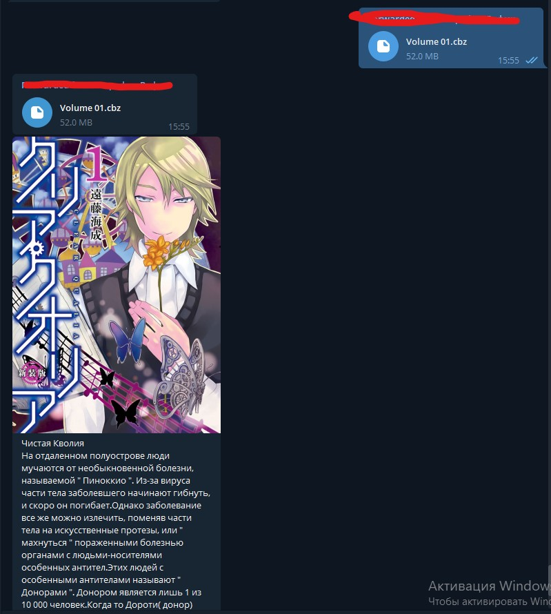
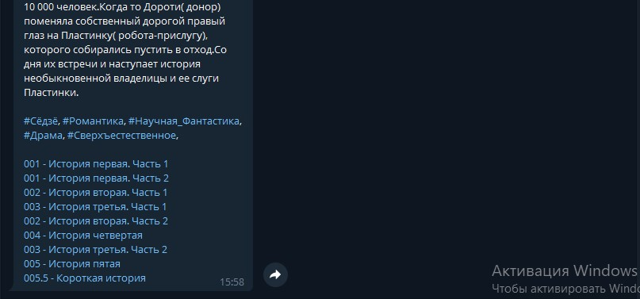

#CBZ/CBR to telegra.ph article bot

A simple bot, that upload your CBZ/CBR archive with many chapters to telegra.ph and return url.

## First step setup
1. Rename "appsettings.example.json" to "appsettings.json"
2. Open appsetting.json and do first step configuration 
```json
{
    "UserBotSettings": {
        "ApiId": "AppID from my.telegram.org",
        "ApiHash": "AppHash from my.telegram.org",
        "PhoneNumber": "Phone number for userbot",
        "FirstName": "Name",
        "LastName": "Subname",
        "Password": ""
    },
    "TelegramBotSettings":{
        "BotUserName": "Bot username without @",
        "Token": "Bot api token",
        "ForwardChatId": "Chat id chat between the bot and the user bot, where the bot will send archives for downloading (Get him after first launch by /chatid)"
    }
}
```
3. Create your bot via [@botfather](https://t.me/botfather) and write his name to `BotUserName` without `@` and api token to `Token`
4. Register your application on [my.telegram.org ](https://my.telegram.org) and write `ApiId` and `ApiHash` to UserBotSettings
5. Write your phone number to `PhoneNumber` (Need for work user bot)
6. Launch Bot
7. When in console you will see `code:` write your authorization code from Telegram PM
8. Join in user bot account via official Telegram App
9. Find your bot
10. Write `/chatid` and paste numbers to `ForwardChatId`

## Second step setup
```json 
"ArticleUploaderSettings": {
        "MaxParallelThreadsForScans": 9,
        "MaxParallelThreadsForArticles": 9,
        "UploadDelay": 20,
        "MaxScansPerChapter": 30,
        "EnableProxy": false,
        "ProxyTxtFileName": "proxies.txt",
        "AuthorName": "Telegra.ph author name",
        "AccessToken": "Access Token from api.telegra.ph"
    }
```
1. Get `AccessToken` from [api.telegraph.org/createAccount](https://telegra.ph/api#createAccount) and copy value from `accessToken`
2. Write any your name in `AuthorName` 
3. Launch and use! ;)
## Configuration
 `"MaxParallelThreadsForScans"` - how many images from uploadable article will send parallel
 ` "MaxParallelThreadsForArticles"` - how many article will send parallel 
 
Warning! The number of sending threads is `MaxParallelThreadsForArticles` x `MaxParallelThreadsForScans`

` "UploadDelay"` - Delay for uploading scans and articles to [telegra.ph](https://telegra.ph)  
`"EnableProxy""` - (Very buggy) Enable proxy for avoid "error: try later" when upload images. Use only when you have a good proxy servers. Prefer using higher `UploadDelay` for avoid this problem.
## Screenshot


